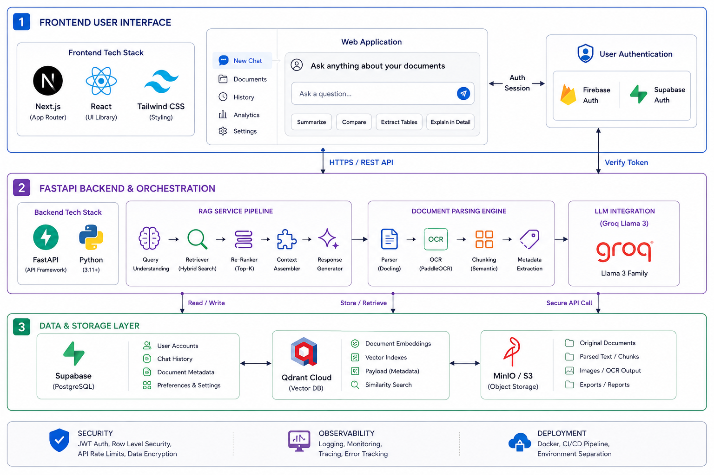

# DocuAI

> Serverless Enterprise Multi-Document RAG Platform with Cross-Device Persistence

DocuAI is a high-performance, serverless Retrieval-Augmented Generation (RAG) platform engineered for multi-document intelligence and automated semantic question-answering over PDF files.

---

## System Architecture



### Architectural Highlights

- **Unified Single-Port Ingress**: Exposes a single public interface on port 3000 for both the Next.js UI and FastAPI endpoints via internal reverse-proxy rewrites, eliminating cross-origin resource sharing (CORS) security overhead.
- **Robust Session and Data Persistence**: Migrated from ephemeral browser localStorage to Supabase PostgreSQL for user-scoped document metadata, persistent chat sessions, and message history.
- **Dual Authentication Architecture**: Powered by Firebase Google Auth (for low-friction social login) and Supabase Magic Link Email OTP (for secure passwordless email login).
- **Interactive Source Citations**: Responses are fully grounded with clickable source badges displaying the document name and specific page numbers (e.g. filename, page X) retrieved from vector metadata.
- **Inline PDF Viewer**: View documents inline in a separate browser tab using optimized Content-Disposition inline headers instead of forcing user downloads.
- **Full Chat Session Management**: Supports creating new chats, inline chat renaming, and chat deletions.
- **Cloud Vector Storage**: 384-dimensional dense vector embeddings generated via Hugging Face Inference APIs and indexed in Qdrant Cloud with metadata-filtered tenant isolation.

---

## Technology Stack

| Layer | Technology | Description |
| :--- | :--- | :--- |
| **Frontend Framework** | Next.js 15 (App Router) | React 19, TypeScript |
| **Styling & UI** | Tailwind CSS / Lucide | Minimalist dark mode UI with interactive states |
| **Database & Persistence** | Supabase PostgreSQL | Profiles, chat sessions, message logs, and doc metadata |
| **Authentication** | Firebase / Supabase Auth | Google OAuth popup + Passwordless Magic Links |
| **Backend API** | FastAPI (Python 3.11+) | Asynchronous execution, BackgroundTasks pipelines |
| **LLM Inference** | Groq API | Llama 3.1 8B instant streaming model |
| **Embeddings** | Hugging Face API | sentence-transformers/all-MiniLM-L6-v2 |
| **Vector Database** | Qdrant Cloud | Metadata-filtered similarity search |
| **Object Storage** | MinIO / AWS S3 | Client-scoped bucket prefixes |

---

## Database Schema (Supabase)

To enable persistent features, run the following schema in the Supabase SQL Editor (supabase_schema.sql):

```sql
-- 1. User Profiles
create table if not exists public.user_profiles (
  id uuid references auth.users(id) on delete cascade primary key,
  email text,
  name text,
  avatar_url text,
  created_at timestamptz default now()
);

-- 2. Documents Metadata
create table if not exists public.documents (
  id text primary key,
  user_id uuid references auth.users(id) on delete cascade,
  session_id text not null,
  name text not null,
  storage_key text not null,
  size bigint default 0,
  uploaded_at timestamptz default now()
);

-- 3. Chat Sessions
create table if not exists public.chat_sessions (
  id text primary key,
  user_id uuid references auth.users(id) on delete cascade,
  session_id text not null,
  title text default 'New Chat',
  created_at timestamptz default now(),
  updated_at timestamptz default now()
);

-- 4. Chat Messages
create table if not exists public.chat_messages (
  id text primary key,
  chat_id text references public.chat_sessions(id) on delete cascade,
  session_id text not null,
  role text not null check (role in ('user', 'assistant')),
  content text not null,
  sources jsonb default '[]'::jsonb,
  created_at timestamptz default now()
);
```

---

## Quickstart

### 1. Environment Configuration

#### Backend Env
Create backend/.env with the following configuration:

```env
# Cloud API Credentials
GROQ_API_KEY=gsk_your_groq_api_key
HF_TOKEN=hf_your_huggingface_token
MAIN_LLM_MODEL=llama-3.1-8b-instant

# Vector Database (Qdrant Cloud)
QDRANT_HOST=https://your-cluster-id.cloud.qdrant.io
QDRANT_API_KEY=your_qdrant_cloud_api_key

# Supabase Configurations
SUPABASE_URL=https://your-project.supabase.co
SUPABASE_SERVICE_KEY=your_supabase_service_role_secret_key
SUPABASE_ANON_KEY=your_supabase_anon_public_key

# Object Storage Configuration
MINIO_ENDPOINT=localhost:9000
MINIO_ACCESS_KEY=minioadmin
MINIO_SECRET_KEY=minioadmin
MINIO_BUCKET=documents
```

#### Frontend Env Local
Create frontend/.env.local with the following configuration:

```env
NEXT_PUBLIC_API_URL=http://localhost:8000
NEXT_PUBLIC_SUPABASE_URL=https://your-project.supabase.co
NEXT_PUBLIC_SUPABASE_ANON_KEY=your_supabase_anon_public_key

# Firebase Auth Configuration
NEXT_PUBLIC_FIREBASE_API_KEY=AIzaSy...
NEXT_PUBLIC_FIREBASE_AUTH_DOMAIN=docuai-1f77f.firebaseapp.com
NEXT_PUBLIC_FIREBASE_PROJECT_ID=docuai-1f77f
NEXT_PUBLIC_FIREBASE_STORAGE_BUCKET=docuai-1f77f.firebasestorage.app
NEXT_PUBLIC_FIREBASE_MESSAGING_SENDER_ID=...
NEXT_PUBLIC_FIREBASE_APP_ID=...
NEXT_PUBLIC_FIREBASE_MEASUREMENT_ID=...
```

### 2. Local Development

Run the entire application stack using a single command:

```bash
# Option A: Root Makefile
make dev

# Option B: From frontend directory
cd frontend
npm install
npm run dev:all
```

Access the application at http://localhost:3000.

---

## Production Cloud Deployment

### Frontend (Vercel)

1. Import the repository into Vercel.
2. In Project Settings > Build and Deployment:
   - Set Root Directory to frontend.
3. In Environment Variables:
   - Set all NEXT_PUBLIC_* keys listed in frontend/.env.local.
4. Deploy.

### Backend (Render / Railway / Docker)

1. Deploy backend/ as a Python Web Service.
2. Start Command: uvicorn main:app --host 0.0.0.0 --port $PORT
3. Configure all backend environment variables (GROQ_API_KEY, HF_TOKEN, QDRANT_HOST, QDRANT_API_KEY, SUPABASE_URL, SUPABASE_SERVICE_KEY, SUPABASE_ANON_KEY).

---

## Security and Multi-Tenancy

Data isolation is strictly enforced at every layer:

1. **Session Assignment**: The client initializes a unique docuai_session_id in browser storage.
2. **Request Scoping**: Requests forward the session identifier in the custom x-session-id HTTP header.
3. **Storage Prefixes**: Files are saved under tenant prefixes (users/session_id/).
4. **Vector Filters**: Qdrant queries execute mandatory metadata filtering on session_id, ensuring absolute cross-tenant isolation.

---

## License

Distributed under the MIT License.